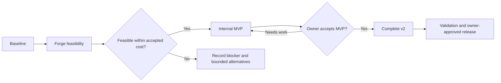

# ManaTomb v2: Commander CPU playtesting

> **September 18 owner update:** G1 is conditionally accepted for local implementation through the full release candidate. Historical benchmark failures stay recorded; separate 2 GiB/one shared CPU Forge is the planning target. The owner operates all hosting, with no agent account/remote access. Local work continues through G2/M3 preparation; owner playthrough, hosted acceptance and enablement remain separate pending checklists. No merge/push/deploy/purchase is authorized. See STATUS.md.

Planning baseline: 2026-09-11. Target public version: **2.0**. This remains the scope and gate record. The local review build and precise remaining acceptance conditions are in [REVIEW_HANDOFF.md](REVIEW_HANDOFF.md). Historical benchmark failures are preserved.

**Outcome:** a player can launch a browser-based Commander match using their own deck, play against one Forge CPU using a custom deck or one of five defaults, finish the match, and return to deck building. Forge owns game rules and CPU decisions. Traditional goldfishing remains available.

## Start here

| Need | Read |
| --- | --- |
| Local review build, manual playthrough and owner deployment steps | [REVIEW_HANDOFF.md](REVIEW_HANDOFF.md) |
| Current position, ownership, next task, outstanding decisions | [STATUS.md](STATUS.md) |
| Scope, milestones, and release boundaries | This document |
| Assignable work and acceptance criteria | [TASKS.md](TASKS.md) |
| Agent instructions, review, and handoff templates | [AGENT_GUIDE.md](AGENT_GUIDE.md) |
| Source findings, proposed architecture, and hosting experiment | [TECHNICAL_PLAN.md](TECHNICAL_PLAN.md) |
| Existing issues and ongoing bug intake | [BUGS.md](BUGS.md) |
| Verified M0 baseline and flow map | [V2-001 evidence](evidence/V2-001.md) |
| M0 issue reproductions and limitations | [V2-002 evidence](evidence/V2-002.md) |
| MVP, quality, operational, and release checks | [VALIDATION.md](VALIDATION.md) |

Read only the task-relevant sections after the start documents. `STATUS.md` is the sole task-status ledger; other files define scope and evidence requirements. GitHub issues hold reports and discussion, with task IDs linking them to this roadmap. Do not maintain a second competing progress board.

## Confirmed product decisions

- v2's one large feature is Commander CPU playtesting, plus appropriate bug fixes.
- Exactly one human and one CPU. Two or three CPU opponents are future work.
- Use Forge for card behavior, legal gameplay choices, timing, resolution, and CPU decisions wherever available. The human still chooses their own actions through the browser.
- Both seats accept user-provided decks. Ship five default CPU decks so a first-time player does not need to supply an opponent deck.
- Do not invent ManaTomb card-rule fixes or silently change game outcomes to work around Forge bugs.
- Prove integration before building the full UI; establish a usable MVP before the final release.
- Prefer one primary implementation agent. Delegate only a small, independent task that saves work. The owner gives final approval before any merge.
- Existing hosting reported by the owner: PostgreSQL, 1 GB RAM / 10 GiB disk; web service, 512 MB RAM / 1 shared vCPU / 50 GB bandwidth / one container on DigitalOcean. Extra spending must be small and justified by measurements.

## Recommended release scope

These recommendations supply planning defaults where the owner requested guidance. They can be revised explicitly; they are not additional user-confirmed requirements.

| Capability | Internal MVP (M2) | Public v2 (M3–M4) |
| --- | --- | --- |
| Match | Complete human-vs-CPU Commander game, engine-controlled | Same, with broader interaction coverage and tested reliability |
| Player deck | Saved deck or pasted custom list | Also launch a snapshot of the current unsaved builder draft |
| Opponent deck | Pasted custom list or one provisional default | Pasted list, owned saved deck, or five versioned defaults |
| Browser UI | Functional desktop board and complete prompts for the MVP test corpus | Polished desktop/tablet, touch alternatives, keyboard access, readable stack and zones |
| Connection | Refresh/reconnect to a still-running session; clear termination on engine loss | Tested transient-loss recovery, duplicate-tab handling, expiry warnings |
| Playtesting aids | Current turn/phase, life, command zone, visible game log, concede | Card inspection, commander damage/counters, documented Forge-supported yields, rematch, return to editor |
| Session results | Win/loss/concede/error shown | Compact summary and downloadable sanitized diagnostic report; no analytics dashboard |
| Access/capacity | Owner/tester accounts behind a flag; one game globally | Signed-in players; one active match per account; measured global cap and honest busy message |
| Failure behavior | Fail visibly and release the session; retain deck inputs | Helpful explanations and report workflow; no silent engine-error correction |
| Rules support | Pinned Forge Commander mode with representative decks | Arbitrary decks accepted by that engine's catalog/validation; supported adapter interactions documented |

Use Forge's **Commander** configuration for two seats; do not silently choose a separate Duel Commander variant. Record and test the actual starting-life, mulligan, ban-list, and first-turn behavior of the pinned configuration. Present the mode clearly in setup.

Five defaults should demonstrate different play styles that Forge handles well, for example creatures/combat, tokens, spells, graveyard value, and ramp. These are selection categories, not selected or verified decklists. Prefer understandable decks over elaborate combos; test every final list under the CPU, record provenance, and make the lists inspectable. No difficulty or power-level guarantees.

“Custom decks” means decklists using cards understood by the pinned Forge catalog, not user-authored card scripts. Missing cards, unsupported deck structures, and mapping ambiguities must be reported before the match. Do not discard or substitute cards silently. In-game Forge faults are surfaced and diagnosed, not mediated by custom game logic.

## Explicitly deferred

- Three/four-player pods, human multiplayer, spectators, tournaments, matchmaking.
- Persistent game save/load across server restarts or deployments, long-term replays, full event sourcing.
- General undo, arbitrary board editing in CPU mode, AI coaching, new difficulty tuning or AI training.
- A dedicated phone layout or promise of phone gameplay parity. Keep setup/help readable on phones and explain the supported play viewport; do not leave broken controls hidden behind an implied support claim.
- Guest CPU access, persistent waiting-room infrastructure, Redis, Kubernetes, autoscaling, a frontend rewrite, or a new database for this feature.
- Unrelated public-deck social features, a general deck-editor redesign, other MTG formats, and local fixes to Forge card logic.

Reuse the existing Go/templates/Tailwind stack and card presentation where practical. Build a separate CPU session/controller flow; the goldfish board's manual card movement must not become a second rules engine for CPU mode.

## Milestones and gates

| Milestone | Deliverable | Exit evidence | Gate |
| --- | --- | --- | --- |
| **M0 — Establish baseline** | Current flows, reproduced bug reports, task ledger, local verification baseline | V2-001 and V2-002 evidence; scope and existing issues mapped | No implementation of the full game UI yet |
| **M1 — Prove Forge** | Pinned headless build; browser-controlled human choices against CPU; measured resource report | V2-010–013; real engine transcript, command used to reproduce, capacity/cost recommendation | Owner accepts feasible adapter/hosting direction before product expansion |
| **M2 — Internal MVP** | Complete custom-deck match through a simple ManaTomb UI; one default; bounded session lifecycle | V2-020–024 and V2-030–031; MVP checklist, full natural match completion, no hidden-data leaks | Owner plays the MVP and records acceptance before M3 polish |
| **M3 — Complete v2** | Five defaults, builder integration, desktop/tablet finish, reliability and scoped fixes | V2-040–045 and required bug cards; final product checklist | Release candidate has no unaccepted blockers |
| **M4 — Validate and release** | Measured soak/load results; reviewed deployment/rollback; owner-approved release | V2-050–052; required CI, browser evidence, capacity decision and owner merge approval | Enable CPU access only on the approved deployment |

M1 requires only a disposable browser proof for human interaction, not a designed battlefield. Passing an AI-vs-AI simulation alone does not pass M1. M2 is a working internal milestone, not the final public v2 quality bar.

No release date or total development/token budget was supplied. Use gate-based progress; estimate remaining work after M1, when the main unknowns have evidence. Avoid percentage-complete estimates based on checkbox count: the feasibility gate carries much more uncertainty than later presentation work.

## Scope and release control

New work must map to the CPU feature, a release-blocking regression, or the scoped bug policy. Record an attractive unrelated idea once in the deferred section of `BUGS.md`; continue the current task. Changes to product scope, paid infrastructure, and release gates need an owner decision with concrete evidence. Routine implementation choices inside an accepted task do not need repeated permission.

Urgent v1 fixes can ship independently with owner approval. The v2 ledger links the patch and carries its regression evidence forward. Rebase/refresh against the approved baseline before integration; do not duplicate an already-fixed bug.

Keep the public site version unchanged until the release task. Follow [the existing release guide](../releases.md) and use its single version source. Proposed numbering: `2.0` for launch, subsequent `2.0.x` bug patches; later large features get their own scoped release plans.
