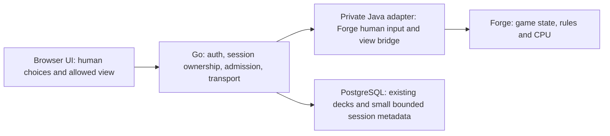

# Technical evidence and proposed integration

Inspected 2026-09-11. **No Forge build, human match, load test, or hosting measurement was executed during roadmap preparation.** Source findings support an integration experiment; they do not prove deployability.

## ManaTomb baseline

Inspected checkout: `a153d9c497cbb5485d90fea7d65fef01d97e2457`. Current source version is `1.0` in [changelog.go](../../internal/web/changelog.go). Verify deployed/upstream state in V2-001.

| Existing area | Evidence | Planning implication |
| --- | --- | --- |
| Go modular monolith, templates, Tailwind, PostgreSQL | [root README](../../README.md), [go.mod](../../go.mod), [package.json](../../package.json) | Add focused modules; no framework migration |
| Go-only runtime image | [Dockerfile](../../Dockerfile) | Java/Forge packaging is new work; the current image cannot simply run Forge |
| Saved/local workbench playtest payloads | [decks_playtest.go](../../internal/web/decks_playtest.go) | Reuse deck snapshots/metadata, not manual game state as authority |
| Client-owned goldfish board | [playtest.js](../../internal/web/assets/playtest.js), [template](../../internal/web/templates/deck_playtest.html.tmpl) | Separate server-owned CPU controller; preserve goldfish behavior |
| Imports already separate canonical card IDs and preferred printings | [decks_import.go](../../internal/web/decks_import.go) | Add an explicit canonical-name/Forge identity boundary |
| Persisted deck has one commander name/printing | [model.go](../../internal/decks/model.go) | Test partner/background representation early; setup-level commander sections may avoid a broad schema/editor change |
| Established routes, CI, version guide | [ROUTES.md](../../internal/web/ROUTES.md), [CI](../../.github/workflows/ci.yml), [releases](../releases.md) | Extend existing checks and release process |

## Forge source findings

Selected and locally tested pin: [`26d8aff87509dde8a9d5017852339382d7ab3e83`](https://github.com/Card-Forge/forge/commit/26d8aff87509dde8a9d5017852339382d7ab3e83), retaining the research revision. [V2-010 evidence](evidence/V2-010.md) records the successful headless build/initialization, natural Commander AI match, runtime/resource identity, notices and human adapter seams. It remains in review; human browser play and hosting capacity are unverified. Reuse its retained external build/cache; do not automatically follow `master`.

| Finding | Primary source | Consequence |
| --- | --- | --- |
| Desktop `server` entry reports dedicated-server mode unimplemented | [Main.java](https://github.com/Card-Forge/forge/blob/26d8aff87509dde8a9d5017852339382d7ab3e83/forge-gui-desktop/src/main/java/forge/view/Main.java) | Build and prove a service adapter; do not assume a ready web backend |
| Headless AI simulation creates Commander players, match and game | [SimulateMatch.java](https://github.com/Card-Forge/forge/blob/26d8aff87509dde8a9d5017852339382d7ab3e83/forge-gui-desktop/src/main/java/forge/view/SimulateMatch.java) | Useful boot benchmark; does not prove human control |
| Human controller uses input queue/proxy and GUI interface | [PlayerControllerHuman.java](https://github.com/Card-Forge/forge/blob/26d8aff87509dde8a9d5017852339382d7ab3e83/forge-gui/src/main/java/forge/player/PlayerControllerHuman.java) | Reuse upstream input handling instead of interpreting rules in Go |
| View/prompt and input-command interfaces already exist | [IGuiGame.java](https://github.com/Card-Forge/forge/blob/26d8aff87509dde8a9d5017852339382d7ab3e83/forge-gui/src/main/java/forge/gui/interfaces/IGuiGame.java), [IGameController.java](https://github.com/Card-Forge/forge/blob/26d8aff87509dde8a9d5017852339382d7ab3e83/forge-gui/src/main/java/forge/interfaces/IGameController.java) | Inventory updates, confirmation/choice/order/entity/damage prompts and input actions |
| Native remote GUI includes blocking replies and game-thread synchronization; transport uses Java object encoding over Netty | [RemoteClientGuiGame.java](https://github.com/Card-Forge/forge/blob/26d8aff87509dde8a9d5017852339382d7ab3e83/forge-gui/src/main/java/forge/gamemodes/net/server/RemoteClientGuiGame.java), [FServerManager.java](https://github.com/Card-Forge/forge/blob/26d8aff87509dde8a9d5017852339382d7ab3e83/forge-gui/src/main/java/forge/gamemodes/net/server/FServerManager.java) | Reference implementation, not a public browser protocol; serialize mutations and expose a narrow data contract |
| Commander registration sets 40 life; deck conformance includes commander and partner constraints | [RegisteredPlayer.java](https://github.com/Card-Forge/forge/blob/26d8aff87509dde8a9d5017852339382d7ab3e83/forge-game/src/main/java/forge/game/player/RegisteredPlayer.java), [DeckFormat.java](https://github.com/Card-Forge/forge/blob/26d8aff87509dde8a9d5017852339382d7ab3e83/forge-core/src/main/java/forge/deck/DeckFormat.java) | Use Forge's Commander preset/validation; test the selected two-seat configuration |
| Import distinguishes unavailable/unsupported cards and sections | [DeckRecognizer.java](https://github.com/Card-Forge/forge/blob/26d8aff87509dde8a9d5017852339382d7ab3e83/forge-core/src/main/java/forge/deck/DeckRecognizer.java) | Show precise preflight failures; never silently drop entries |
| Build targets Java 17 and enforces Maven 3.8.1+ | [pom.xml](https://github.com/Card-Forge/forge/blob/26d8aff87509dde8a9d5017852339382d7ab3e83/pom.xml) | Pin a compatible toolchain; human integration still uses `forge-gui` classes |
| Shared model/UI/random/thread state exists | [FModel.java](https://github.com/Card-Forge/forge/blob/26d8aff87509dde8a9d5017852339382d7ab3e83/forge-gui/src/main/java/forge/model/FModel.java), [MyRandom.java](https://github.com/Card-Forge/forge/blob/26d8aff87509dde8a9d5017852339382d7ab3e83/forge-core/src/main/java/forge/util/MyRandom.java), [ThreadUtil.java](https://github.com/Card-Forge/forge/blob/26d8aff87509dde8a9d5017852339382d7ab3e83/forge-core/src/main/java/forge/util/ThreadUtil.java) | Concurrency isolation and independent deterministic replay are unproven; begin with one live match per worker |
| Upstream lazy script loading can skip unused deck-generation initialization | [FModel.java](https://github.com/Card-Forge/forge/blob/26d8aff87509dde8a9d5017852339382d7ab3e83/forge-gui/src/main/java/forge/model/FModel.java) | Benchmark supported settings before modifying engine internals |
| AI uses heuristics and has strengths/weaknesses by deck style | [AI.md](https://github.com/Card-Forge/forge/blob/26d8aff87509dde8a9d5017852339382d7ab3e83/docs/AI.md), [AiProfileUtil.java](https://github.com/Card-Forge/forge/blob/26d8aff87509dde8a9d5017852339382d7ab3e83/forge-ai/src/main/java/forge/ai/AiProfileUtil.java) | Pin one upstream profile; validate defaults; do not promise competitive play or invent a difficulty slider |
| Root includes GPL v3 text; inspected Java headers say v3-or-later | [LICENSE](https://github.com/Card-Forge/forge/blob/26d8aff87509dde8a9d5017852339382d7ab3e83/LICENSE), [source header](https://github.com/Card-Forge/forge/blob/26d8aff87509dde8a9d5017852339382d7ab3e83/forge-gui-desktop/src/main/java/forge/view/Main.java) | Inventory actual components/resources and implement their notices/source handling in the integration/release work |

The licensing row records source text, not a legal conclusion about the combined application. Exact packaging and distributed artifacts remain to be chosen.

## Proposed architecture — validate at G1

This is a responsibility boundary, not a commitment to a new paid service before testing. Prefer a separate constrained engine process/service so CPU load or failure does not take down deck browsing. Do not give the engine the primary database credentials. Go sends immutable deck input and receives status/views; the Java adapter owns the live Forge session.

Start with one active match per worker and a global admission cap of one. Safe concurrent sessions inside one JVM have not been established. Recycle after a failed/stuck match; select between recycling every match and validated sequential reuse using measured startup cost and isolation. A restart may clear a lost session but must not reset account limits or allow stale client commands to affect a new game. No process creation without a global reservation and a resource ceiling.

Use one browser transport selected by the spike, for example JSON commands plus an event stream, or WebSocket. Prove real DigitalOcean ingress behavior, heartbeats, disconnect/reconnect, and idle timeouts before freezing the contract. Do not build both transports by default. Native Forge Java object networking is not exposed to browsers.

### Contract requirements

- Game creation binds an authenticated owner to a human seat and a session incarnation; it returns an opaque ID and engine/config/resource identity.
- Commands carry a unique request ID, expected revision, and current prompt identity. An accepted command is acknowledged; duplicate retries return its known result rather than executing again. If the result is uncertain, resync before another action. Never claim crash-proof exactly-once execution; a lost worker ends the session.
- State is a player-specific view derived from Forge's visibility rules. Unrevealed CPU hand/library identities, hidden ordering, hidden choices and private logs never enter client JSON. Information Forge explicitly permits the human to see, including legitimate reveals, is rendered faithfully. Mask unauthorized object metadata as well as card names; face-down/revealed/visibility-revoked transitions need fixtures.
- Human choices come from Forge prompts/input semantics. The browser may make them easier to select, but must preserve option constraints and ordering. A UI-side check is convenience, not gameplay authority.
- Engine updates and actions run through the proven per-game serialization boundary. Reject stale/invalid input and return the latest appropriate view. Browser timestamps or locally updated life totals never become authoritative.
- Record terminal states distinctly: finished, conceded, expired, engine error, administrative termination. Game results originate from Forge; infrastructure failures are not automatically player losses.

### Deck and card boundaries

Keep Scryfall/printing metadata for presentation and Forge identities/scripts for behavior. Map a canonical deck entry once, with exact commander section(s), quantities, and deterministic name handling. Record source deck hashes and match-start snapshots. Fail ambiguous mapping explicitly. Images stay in the existing presentation flow; no server-side Forge artwork cache is needed to decide gameplay.

The engine's supported card catalog changes independently of ManaTomb's Scryfall sync. Pin Forge code **and** resources/configuration, show the engine version in diagnostics, and test catalog changes before deployment. A card being present in ManaTomb's search does not establish that the selected Forge version can play it. Broad custom-deck support does not promise perfect behavior for every Magic card or every possible interaction.

### Session/retention defaults to validate

Proposed initial settings: one active match per account; global cap one; five-minute disconnected grace; fifteen-minute idle timeout while awaiting human input, with a warning before expiry; two-hour maximum session with advance warning. These are tunable resource controls, not MTG rules. Record final values at G2 and display limits before starting. Human activity renews idle time; socket heartbeats and a stuck CPU do not renew it indefinitely.

On disconnect, stop requesting further human actions and pause at the next safe engine boundary if supported; an already-running CPU decision may complete. Resume from the actual engine state. On expiry, cancel/recycle the worker and report termination, without auto-passing or fabricating human decisions. A CPU decision deadline is chosen from M1 measurements; a watchdog must recover capacity even when cooperative cancellation fails.

For v2, live game state is memory-resident. Browser reconnect is possible only while that worker/session still exists. Server/deployment restart ends it. Store only necessary ownership/admission metadata and bounded summaries if needed; do not persist the Forge object graph or every game event to PostgreSQL. Suggested diagnostic retention: seven days with a total size cap chosen after measurement; never persist full private/hidden game state by default. Existing DB disk usage must be measured before adding retained data.

## Hosting experiment and spending decision

The existing web and database allocations are separate: database RAM cannot host the Java process. There is no evidence yet that Go and Forge can safely share 512 MB. The recommended first investigation is local, resource-capped, one-game execution; purchase nothing during the spike.

Candidate App Platform prices checked 2026-09-11; USD/month, before taxes/other charges. These are options, not measured Forge requirements or approved spending.

| Candidate | Increment over existing web service | Tradeoff |
| --- | --- | --- |
| Keep 512 MiB Go service, add no engine | $0 | Baseline; CPU feature not available |
| Resize shared web service to 1 GiB fixed | About +$5 | Investigate only if cohosting demonstrates safe headroom/isolation |
| Add separate 1 GiB fixed engine service | About +$10 | First isolated candidate to benchmark |
| Add separate 1 GiB scalable-plan engine service | About +$12 | Alternative plan; no scaling commitment |
| Add separate 2 GiB engine service | About +$25 | Consider only if smaller option fails and owner accepts cost |

Prices derive from [DigitalOcean's current App Platform table](https://docs.digitalocean.com/products/app-platform/details/pricing/). Recheck plan availability and the actual incremental bill before provisioning. Keep PostgreSQL unchanged unless measurements establish a separate need. If none is affordable, keep CPU development local and present the blocker; do not quietly cut custom decks or ship an unstable instance.

App Platform supports [internal service routing](https://docs.digitalocean.com/products/app-platform/how-to/manage-internal-routing/), which is a candidate for Go-to-engine traffic. Verify the selected plan/network configuration and keep engine endpoints inaccessible to the public.

Its container-local storage is ephemeral, limited to 4 GiB, and has no volume support. Linux AMD64 is required; large images have deployment caveats. Package only required engine resources and measure artifact/temp/log size. Durable saves cannot rely on container files. [DigitalOcean limits](https://docs.digitalocean.com/products/app-platform/details/limits/)

### Required measurement report (V2-012; repeat relevant parts for V2-050)

Fill observed results; leave unknowns as “not measured.” A machine's installed RAM is not the enforced container limit.

| Measurement | 512 MiB / 1 CPU | 1 GiB / 1 CPU | 2 GiB / 1 CPU | Evidence |
| --- | --- | --- | --- | --- |
| Cold start / card initialization | Not measured | Not measured | Not measured | — |
| Warm ready RSS and whole-container memory | Not measured | Not measured | Not measured | — |
| Active match peak; idle-human-prompt memory | Not measured | Not measured | Not measured | — |
| CPU decision p50 / p95 / max; game duration | Not measured | Not measured | Not measured | — |
| Adapter action acknowledgement / view update latency | Not measured | Not measured | Not measured | — |
| Post-game RSS/threads after sequential cycles | Not measured | Not measured | Not measured | — |
| Cancel/hang/worker-death reclamation time | Not measured | Not measured | Not measured | — |
| Engine artifact/temp/log size; bytes per match | Not measured | Not measured | Not measured | — |
| Existing site p95/error rate under play load | Not measured | Not measured | Not measured | — |

Record OS/architecture, CPU and memory limits, JVM flags, heap/nonheap/native memory, upstream lazy-loading setting, Forge/adapter/resource/deck hashes, AI profile, random seed if controllable, repetitions and sampling interval. A seed supports reproduction only if verified; shared RNG/global state means deterministic replay is not assumed.

Use simple and demanding Commander fixtures, not only a tiny all-land demo. Run at least five repetitions per selected workload and ten sequential create/play/end-or-abort cycles; expand only when an unresolved trend needs more evidence. Inspect memory plateau after warm-up rather than expecting Java to return all RSS after each match. Test both ordinary completion and forced termination.

Proposed acceptance targets, to freeze with the G1 report:

- No out-of-memory termination, unbounded growth, leaked sessions or unreclaimable threads at the selected cap. Keep at least roughly 20% container-memory headroom under the representative measured peak; JVM heap cap alone is not proof.
- Ready-session human command acknowledgement p95 under one second, excluding actual engine computation and internet latency. Measure engine decision p50/p95/max separately; choose a visible slow-turn threshold and bounded decision watchdog from evidence.
- Propose a 30-second ready/start UI threshold and 30-second forced-reclamation target; report cold starts separately. If an upstream initialization path exceeds these, make the user-visible compromise explicit at G1 instead of claiming a pass.
- Existing deck/search/save traffic remains usable: compare baseline and with-engine p95/error rates under the same workload; proposed maximum p95 degradation 20%, no new errors. Record the workload so a low-load empty-site test cannot imply general capacity.
- Global cap rejects the next start immediately and honestly. One accepted game does not imply support for two; only raise the cap after tests at the new level.

Percentile targets require the observation count in the report. They are engineering budgets, not public service guarantees. If a target fails, report a conditional/no-go result and the measured tradeoff; do not quietly relax it after seeing the number.

## Principal risks and responses

| Risk | Early test | Response if unresolved |
| --- | --- | --- |
| Human input bridge depends on desktop assumptions | V2-010/011 input map and real browser prompts | Bound adapter work; stop expansion if it requires rules reimplementation |
| Forge exceeds affordable CPU/RAM | V2-012 | Use supported lazy-loading settings, cap games, compare exact low-cost options; owner decides |
| Global state contaminates games or prevents cancellation | Sequential isolation/fault tests | Isolated worker recycling; no assumed parallel JVM games |
| Generic UI cannot express a legal choice | Prompt-family corpus | Implement faithful adapter/UI; never skip the decision |
| Custom decks import but play poorly or fail upstream | Catalog preflight plus varied real matches | Surface specific limitation; keep rules upstream; release gate if widespread |
| Two-commanders do not fit existing model | V2-020 fixture and setup schema | Session-level representation or narrow compatible schema change; owner decision on any exclusion |
| Reconnect replays an action or leaks hidden state | Retry/visibility tests | Server-owned command/prompt identities and filtered snapshots |
| Small database fills with logs | Bounded retention/volume calculation | Keep event history ephemeral; persist minimal metadata |
| Deployment interrupts games or breaks v1 | Drain/flag/rollback rehearsal | Disable new starts, explain live-game termination, preserve existing app paths |

Performance, reliability, and prompt completeness remain unknown until measured. This document should be amended with concise evidence rather than replaced by recurring broad research.
